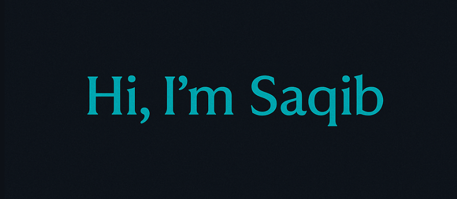

<div align="center">



### Full-Stack Developer | React • Next.js • Node.js • TypeScript

**Building scalable web applications with clean interfaces, reliable backends, and maintainable code.**

<br />

<a href="https://saqib-ahmad-dev.netlify.app/">
  
</a>
<a href="https://www.linkedin.com/in/saqib-ahmad-dev">
  
</a>

<br /><br />


</div>

---

## 👨‍💻 About Me

I am a **Full-Stack Developer from Bangladesh** focused on building modern, responsive, and scalable web applications.

I enjoy transforming ideas into practical digital products by combining thoughtful user interfaces with secure and efficient backend systems. My development approach emphasizes **clean architecture, maintainable code, performance, accessibility, and user experience**.

* 🚀 Building full-stack applications with **React, Next.js, Node.js, and TypeScript**
* 🎨 Creating responsive interfaces using **Tailwind CSS**
* ⚙️ Developing REST APIs with **Node.js, Express.js, and Go**
* 🗄️ Working with relational and NoSQL databases
* 🔐 Implementing authentication with **OAuth and Firebase**
* 🐳 Containerizing applications with **Docker**
* ☁️ Deploying production-ready applications through **Vercel, Netlify and Render**

> **I do not just build features. I build maintainable solutions that solve real problems.**

---

## 🛠️ Technical Skills

### Frontend Development

<p>
  
</p>

### Backend Development

<p>
  
</p>

### Databases and Services

<p>
  
</p>

### Development Tools and Deployment

<p>
  
</p>

---

## 💡 What I Bring to a Team

```text
✓ Responsive and accessible user interfaces
✓ Reusable and maintainable component architecture
✓ Secure API and authentication integration
✓ Relational and NoSQL database development
✓ Clean Git and GitHub collaboration workflows
✓ Performance-focused full-stack development
✓ Strong problem-solving and debugging skills
```

---

## 🌱 Currently Improving

I am currently strengthening my knowledge in:

* Advanced backend architecture and API design
* Go development for high-performance backend services
* Docker-based development and deployment workflows
* Database optimization and scalable data modeling
* Application security and authentication
* Automated testing and production-ready development practices

---

## 📈 GitHub Activity

<div align="center">

<a href="https://github.com/saqib0404">
  
</a>

<a href="https://github.com/saqib0404?tab=repositories">
  
</a>

</div>

<br />

I actively use GitHub to build, document, and improve full-stack applications using **React, Next.js, TypeScript, Node.js, Express, PostgreSQL, MongoDB, Prisma, Docker, and Go**.

My repositories demonstrate practical experience in:

- Developing responsive frontend applications
- Building REST APIs and backend services
- Designing relational and NoSQL databases
- Implementing authentication and authorization
- Structuring maintainable full-stack projects
- Deploying applications to production

---

## 🚀 Featured Projects

<table>
<tr>
<td width="50%" valign="top">

### 🚗 SpotSync — Parking Reservation API

A high-performance parking management and reservation API built with **Go**. It uses strict database row-level locking to prevent race conditions and overbooking during concurrent reservations.

The system tracks real-time availability across **EV and standard parking zones** and provides secure, role-based access through JWT authentication.

**Key Features**

* Concurrency-safe parking reservations
* Database row-level locking
* Real-time EV and standard zone availability
* Role-based authorization
* Secure JWT authentication
* Scalable REST API architecture

**Tech Stack:** Go, PostgreSQL, JWT, REST API, Render

<a href="https://spot-sync-bhq9.onrender.com">
  
</a>

</td>
<td width="50%" valign="top">

### 🚨 CrisisDesk AI — Emergency Triage API

A backend-focused emergency triage API built with **Node.js, Express, and Prisma**. It uses AI to process multilingual citizen reports submitted in **Bangla and English**.

The system classifies, structures, prioritizes, and deduplicates emergency reports, helping public service teams identify critical incidents and respond more effectively.

**Key Features**

* AI-assisted emergency report classification
* Bangla and English report processing
* Duplicate incident detection
* Automated priority assessment
* Structured incident data generation
* Backend API for public service management

**Tech Stack:** Node.js, Express.js, Prisma, AI Integration, REST API, Render

<a href="https://crisisdesk-ai-hackathon.onrender.com">
  
</a>

</td>
</tr>
</table>

> These projects demonstrate my experience in backend engineering, API development, database concurrency, authentication, artificial intelligence integration, and production deployment.


## 🌐 Explore My Work

My portfolio contains selected projects that demonstrate my experience in frontend development, backend development, API integration, database management, authentication, responsive design, and application deployment.

<div align="center">

### [Visit My Developer Portfolio](https://saqib-ahmad-dev.netlify.app/)

</div>

---

## 🤝 Let's Connect

I am always interested in connecting with recruiters, developers, and teams working on meaningful digital products.

Whether you would like to discuss a **full-stack development opportunity, professional collaboration, or software project**, feel free to reach out through LinkedIn.

<div align="center">

<a href="https://www.linkedin.com/in/saqib-ahmad-dev">
  
</a>

<a href="https://saqib-ahmad-dev.netlify.app/">
  
</a>

<br /><br />


<br /><br />

### Clean code. Thoughtful design. Reliable solutions.

</div>
